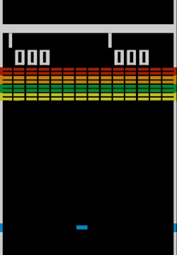

# 🎮 BREAKOUT - Vintage Arcade Edition

A production-ready Breakout clone with authentic 1976 Atari arcade styling and modern web polish. Built with vanilla JavaScript and optimized for Vercel deployment.



## ✨ Features

### Core Gameplay
- **Classic Breakout Mechanics** - Ball physics, paddle collision, and brick destruction
- **8 Unique Levels** - Progressive difficulty with unique brick patterns
- **Power-Up System** - Multi-ball, paddle extend, speed control, and extra life
- **Lives System** - 3 lives with game over on depletion
- **High Score Tracking** - Persistent high scores using localStorage

### Visual Effects
- **CRT Scanlines** - Authentic cathode ray tube display simulation
- **Phosphor Glow** - Bright elements glow like vintage arcade monitors
- **Particle Effects** - Brick destruction, score popups, and celebration fireworks
- **Ball Trail** - Motion blur effect for enhanced visual feedback
- **Retro Typography** - Pixelated "Press Start 2P" font throughout

### Controls
| Input | Action |
|-------|--------|
| **Arrow Keys / WASD** | Move paddle left/right |
| **Mouse** | Move paddle to cursor position |
| **Touch** | Mobile touch controls |
| **Spacebar** | Pause/Resume game, Start game |
| **Mobile Pause Button** | Pause on mobile devices |

**Note**: Ball auto-launches after 5-second countdown (5-4-3-2-1-START!)

## 🎯 Game Mechanics

### Scoring System
- 🔴 **Red Brick** - 25 points
- 🟠 **Orange Brick** - 50 points
- 🟢 **Green Brick** - 75 points
- 🔵 **Blue Brick** - 100 points
- ⭐ **Power-Up Collection** - 150 points

### Power-Ups (10% Drop Chance)
| Power-Up | Effect | Duration |
|----------|--------|----------|
| ●● Multi-Ball | Spawns 2 additional balls | Permanent |
| ▬▬ Extend | Increases paddle width by 50% | 10 seconds |
| ◐ Slow | Reduces ball speed by 50% | 8 seconds |
| ◈ Fast | Increases ball speed by 25% | 6 seconds |
| ♥ Extra Life | Grants one additional life | Instant |

### Level Progression
1. **Level 1** - Full Rectangle (52 bricks)
2. **Level 2** - Checkerboard Pattern (48 bricks)
3. **Level 3** - Pyramid Formation (44 bricks)
4. **Level 4** - Diamond Pattern (40 bricks)
5. **Level 5** - Wave Design (36 bricks)
6. **Level 6** - Spiral Formation (32 bricks)
7. **Level 7** - Random Gaps (28 bricks)
8. **Level 8** - Boss Fortress (24 bricks)

Each level increases ball speed by 0.2 units.

## 🚀 Quick Start

### Local Development

```bash
# Install dependencies
npm install

# Start development server (opens at http://localhost:3000)
npm run dev

# Build for production
npm run build

# Preview production build
npm run preview
```

### Project Structure
```
game_demo3/
├── index.html              # Main HTML entry point
├── style.css               # CRT effects and styling
├── src/
│   ├── main.js            # Game loop and state management
│   ├── game/
│   │   ├── Paddle.js      # Paddle mechanics
│   │   ├── Ball.js        # Ball physics
│   │   ├── Brick.js       # Brick class
│   │   ├── BrickManager.js # Level layouts
│   │   ├── PowerUp.js     # Power-up system
│   │   └── ParticleSystem.js # Visual effects
│   ├── ui/
│   │   └── UI.js          # All game screens
│   └── utils/
│       └── SoundManager.js # Retro sound effects
├── package.json
├── vite.config.js
└── vercel.json            # Vercel deployment config
```

## 🎨 Design Philosophy

This game replicates the authentic feel of 1976 Atari arcade cabinets:

- **No Anti-Aliasing** - Blocky, pixelated graphics for authenticity
- **Scanline Overlay** - Simulates CRT monitor horizontal lines
- **Phosphor Glow** - Bright elements bloom like vintage phosphor screens
- **Retro Palette** - Vibrant primary colors on pure black background
- **8-bit Sound** - Square wave beeps using Web Audio API
- **Frame Flicker** - Subtle animation mimics 60Hz CRT refresh

## 📱 Mobile Support

The game is fully responsive and touch-enabled:
- Touch and drag to move paddle
- Tap to launch ball
- Dedicated pause button for mobile
- Optimized canvas scaling for all screen sizes

## 🧪 Browser Compatibility

Tested and working on:
- ✅ Chrome 90+
- ✅ Firefox 88+
- ✅ Safari 14+
- ✅ Edge 90+
- ✅ Mobile browsers (iOS Safari, Chrome Mobile)

## 📈 Performance

- **60 FPS** - Smooth gameplay using requestAnimationFrame
- **Optimized Rendering** - Efficient canvas operations
- **Minimal Bundle** - ~15KB minified (excluding fonts)
- **No Dependencies** - Pure vanilla JavaScript

## 🎵 Sound Effects

Retro arcade sounds generated using Web Audio AM:
- Paddle hit (pitch varies by hit position)
- Brick destruction (pitch varies by brick value)
- Power-up collection
- Ball lost
- Level complete fanfare
- Game over sequence

## 🏆 Credits

- **Inspired by**: Atari Breakout (1976)
- **Font**: [Press Start 2P](https://fonts.google.com/specimen/Press+Start+2P) by CodeMan38
- **Built with**: Vanilla JavaScript + Vite
- **Deployed on**: Vercel

## 📄 License

MIT License - Feel free to use this code for your own projects!

---

**Enjoy the nostalgia! 🕹️**
